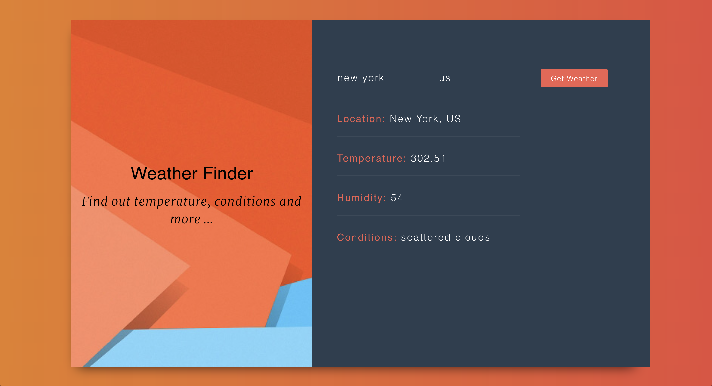

##Weather App
- [react.js](https://reactjs.org).
- [create-react-app](https://github.com/facebook/create-react-app).
- [bootstrap@3.3.7](https://getbootstrap.com).

## Overview

Users type in their location, and press the "Get Weather" button, then the app will return the weather information thru API from [OpenWeatherMap](https://openweathermap.org).
